# Assignment1

## Usage

### 1.1 task1

- **task**: Transfrom `input/nobel.jpg` to `input/lena.jpg` through an opening circle.

- **solution**: Run the script `nobel2lena.py` with following command *(python3, tqdm, opencv3 are needed)*.

```shell
python3 nobel2lena.py
```

The program will output result video `output/nobel2lena.mp4` which transform from `input/nobel.jpg` to `input/lena.jpg`, like:

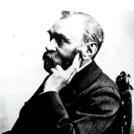

refs:

>  [create a video with opencv](https://docs.opencv.org/3.4.3/d7/d9e/tutorial_video_write.html)

### 1.2 To 8 bits

> Use K-d tree to build 8-bit color LUT (Look-Up Table) in order to compress 24-bit image.

- **task**: For LUT table, try out median-out algorithm on image `input/redapple.jpg`.
- **solution**:  I try out the K-d tree algorithm to build LUT and also compare the result with fix divide-dim order methods' result.

> 'Best' means K-d tree algorithm splits node with the widest dim on pixel
>
> 'Order' means K-d tree algorithm splits node with fix order, like 'rgbrgbrg', 'rgbrgbrr', 'rgbrrrrr'
>
> I try different dim order by adding more red gradient in order to see which order is best.

Run:

```shell
python3 to8bits.py
```

Then you will see the result:

```shell
processing 'output/redapple_best.jpg'...
processing 'output/redapple_order_rgbrgbrg.jpg'...
processing 'output/redapple_order_rgbrgbrr.jpg'...
processing 'output/redapple_order_rgbrrrrr.jpg'...

 == Mean square error ==
[BEST]:            19.1589
[ORDER: rgbrgbrg]: 21.2698
[ORDER: rgbrgbrr]: 24.0168
[ORDER: rgbrrrrr]: 42.5347
```

- Some result images will output in directory `output`:

| origin image: `redapple.jpg`                                 | 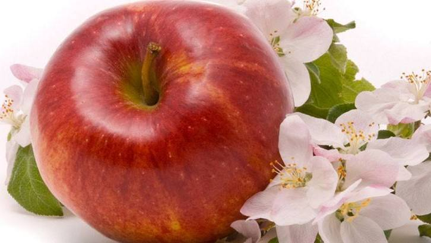                            |
| ------------------------------------------------------------ | ------------------------------------------------------------ |
|                                                              |                                                              |
| `output/redapple_best.jpg`                                   | `output/redapple_order_rgbrgbrg.jpg`                         |
| 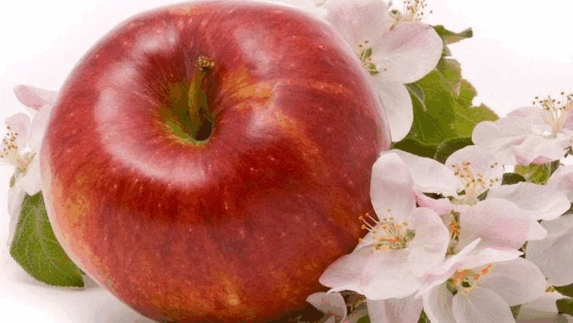                  | 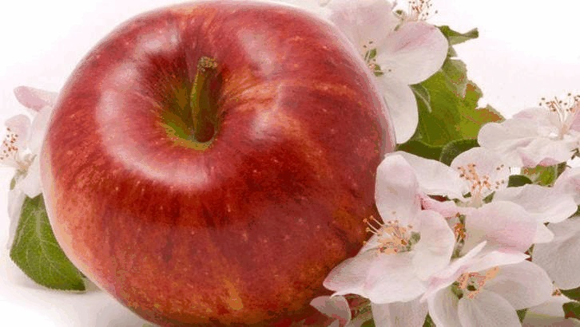 |
| `output/redapple_order_rgbrgbrr.jpg`                         | `output/redapple_order_rgbrrrrr.jpg`                         |
| 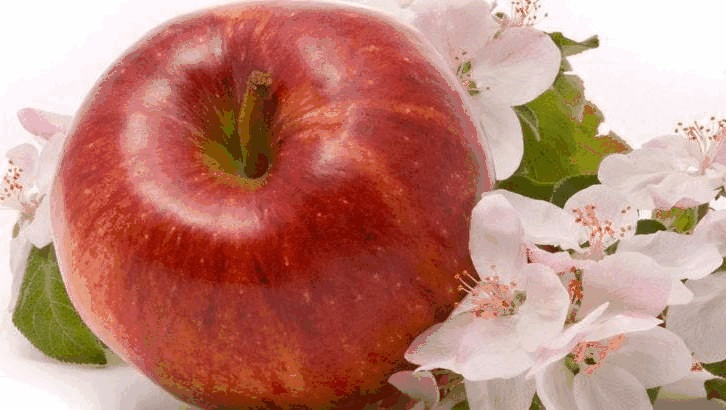 | 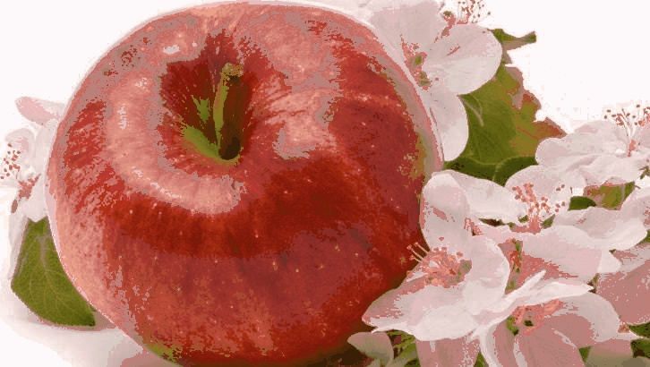 |

- Performance compare:

| Origin                                          | Best                                            | Fix order: 'rgbrgbrg'                           |
| ----------------------------------------------- | ----------------------------------------------- | ----------------------------------------------- |
| 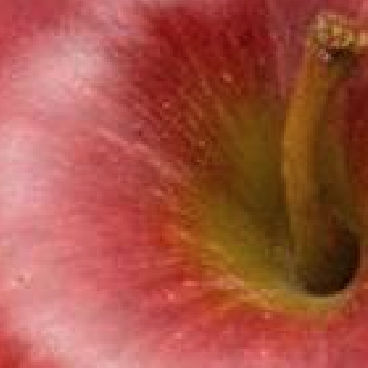     | 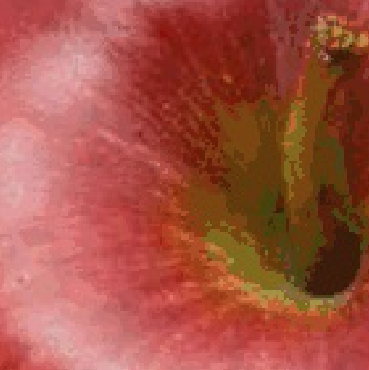         |  |
|                                                 |                                                 |                                                 |
| **Fix order: 'rgbrgbrr' **                      | **Fix order: 'rgbrrrrr' **                      |                                                 |
| 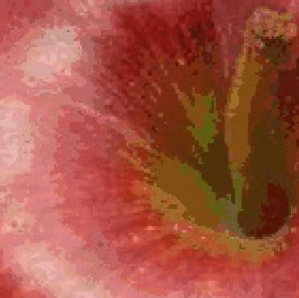 | 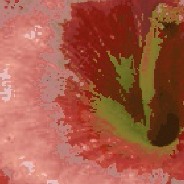 |                                                 |


- Benchmark compare:

| Algorithm (KDtree)    | Mean Square Error |
| --------------------- | ----------------- |
| Best                  | 19.1589           |
| Fix order: 'rgbrgbrg' | 21.2698           |
| Fix order: 'rgbrgbrr' | 24.0168           |
| Fix order: 'rgbrrrrr' | 42.5347           |


### 1.3 Dithering

> My dithering sample experiment.

Run:

```shell
python3 dithering_sample.py
```

Then, we get result `output/dithered_4x4mat.bmp`:


You are allow to change to 2x2 dither matrix by changing the script `dithering_sample.py` in line 82-83:

```python
MATRIX = DITHER_MATRIX2x2
# MATRIX = DITHER_MATRIX4x4
```

2x2 result is like that:

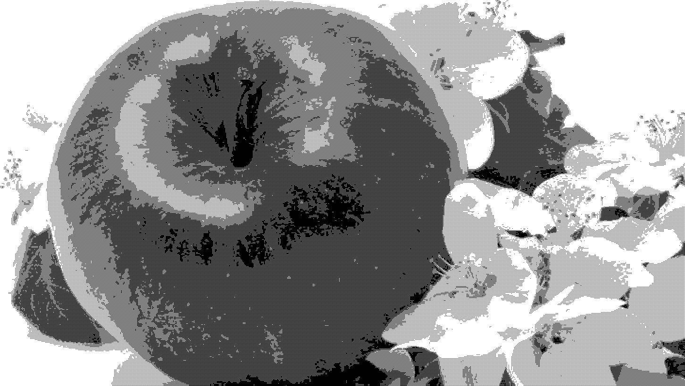

You are also allow to change to create 4x4 othered dither matrix by changing the script `dithering_sample.py` in line 85-86:

```python
# mode = "normal"
mode = "ordered"
```

ordred dithering result:

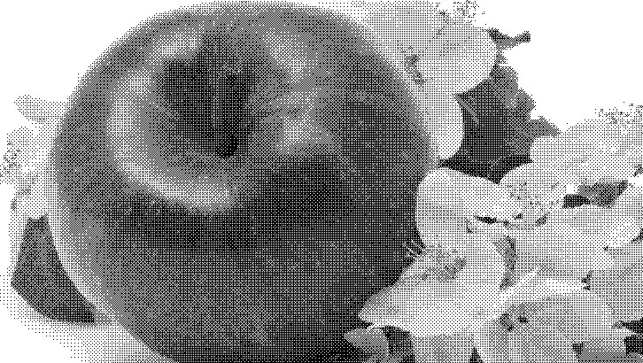