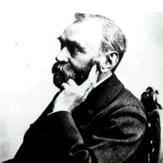

# Assignment1

## Usage


### 1.1 task1

- **task**: Transfrom `asserts/nobel.jpg` to `asserts/lena.jpg` through an opening circle.

- **solution**: Run the script with following command *(python3, tqdm, opencv3 are needed)*.

```shell
python3 nobel2lena.py
```

The program will output result video `output.mp4` which transform from `asserts/nobel.jpg` to `asserts/lena.jpg`, like:



refs:

>  [create a video with opencv](https://docs.opencv.org/3.4.3/d7/d9e/tutorial_video_write.html)